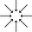

<!---
Copyright (c) 2021 - present / Neuralmagic, Inc. All Rights Reserved.

Licensed under the Apache License, Version 2.0 (the "License");
you may not use this file except in compliance with the License.
You may obtain a copy of the License at

    http://www.apache.org/licenses/LICENSE-2.0

Unless required by applicable law or agreed to in writing, software
distributed under the License is distributed on an "AS IS" BASIS,
WITHOUT WARRANTIES OR CONDITIONS OF ANY KIND, either express or implied.
See the License for the specific language governing permissions and
limitations under the License.
-->

#  Sparsify

### Easy-to-use interface to automatically sparsify and fine-tune models for better performance and smaller footprint

<p>
    <a href="https://github.com/neuralmagic/comingsoon/blob/master/LICENSE">
        
    </a>
    <a href="https://docs.neuralmagic.com/sparsify/">
        
    </a>
    <a href="https://github.com/neuralmagic/sparsify/releases">
        
    </a>
    <a href="https://github.com/neuralmagic.com/comingsoon/blob/master/CODE_OF_CONDUCT.md">
        
    </a>
     <a href="https://www.youtube.com/channel/UCo8dO_WMGYbWCRnj_Dxr4EA">
        
    </a>
     <a href="https://medium.com/limitlessai">
        
    </a>
    <a href="https://twitter.com/neuralmagic">
        
    </a>
 </p>

## Overview

Sparsify is a deep learning model acceleration tool that simplifies the model optimization process to rapidly achieve the best combination of size, speed, and accuracy on any deep learning model. Sparsify optimizes and benchmarks models informed by industry research insights for ML practitioners, including ML engineers and operators, who need to deploy performant deep learning models fast and at scale. Sparsify shows visual performance potential for your model, including a sliding scale between performance and loss sensitivity, ultimately speeding up the model optimization process from weeks to minutes.

This repository contains the package to locally launch Sparsify where you can create projects to load and optimize your deep learning models. At the end, you can export configuration files to deploy within your training workflow.

## Quick Tour and Documentation

Follow the quick tour below to get started.
For a more in-depth read, check out [Sparsify documentation](https://docs.neuralmagic.com/sparsify/).
It provides the following for you to use Sparsify:

- Learning path and goals
- Basic examples
- Details of features
- Advanced options
<!--- the docs url will become active once Marketing configures it. --->

### Requirements

- This repository is tested on Python 3.6+, PyTorch base-ver+ and TensorFlow 1.x+
- Use Case: Computer Vision - Image Classification, Object Detection
- Model Architectures: Deep Learning Neural Network Architectures (e.g., CNNs, DNNs - refer to [SparseZoo](https://docs.neuralmagic.com/sparsezoo/) for examples)
- Instruction Set: CPUs with AVX2 or AVX-512 (best); (e.g., Intel Xeon Cascade Lake, Icelake, Skylake; AMD) and 2 FMAs. VNNI support required for sparse quantization.
- OS / Environment: Linux

### Installation

To install, run:

```bash
pip install sparsify
```

To launch Sparsify, type the following command:

```bash
sparsify
```

## Tutorials

[TODO ENGINEERING]

## Available Models and Recipes

[TODO ENGINEERING]

## Resources and Learning More

- [Sparsify Documentation](https://docs.neuralmagic.com/sparsify/)
- [Sparsify Use Cases]([TODO ENGINEERING])
- [Sparsify Examples] Coming soon in February 2021
- [SparseML Documentation](https://docs.neuralmagic.com/sparseml/)
- [SparseZoo Documentation](https://docs.neuralmagic.com/sparsezoo/)
- [DeepSparse Documentation](https://docs.neuralmagic.com/deepsparse/)
- [Neural Magic Blog](https://www.neuralmagic.com/blog/), [Resources](https://www.neuralmagic.com/resources/), [Website](https://www.neuralmagic.com/)

## Contributing

We appreciate contributions to the code, examples, and documentation as well as bug reports and feature requests! [Learn how here](CONTRIBUTING.md).

## Join the Community

For user help or questions about SparseML, use our [GitHub Discussions](https://www.github.com/neuralmagic/sparsify/discussions/). Everyone is welcome!

You can get the latest news, webinar and event invites, research papers, and other ML Performance tidbits by [subscribing](https://neuralmagic.com/subscribe/) to the Neural Magic community.

For more general questions about Neural Magic, please email us at [learnmore@neuralmagic.com](mailto:learnmore@neuralmagic.com) or fill out this [form](http://neuralmagic.com/contact/).

## License

The project is licensed under the [Apache License Version 2.0](LICENSE).

## Release History

[Track this project via GitHub Releases.](https://github.com/neuralmagic/sparsify/releases)

## Citation

Find this project useful in your research or other communications? Please consider citing:

```bibtex
@InProceedings{pmlr-v119-kurtz20a, title = {Inducing and Exploiting Activation Sparsity for Fast Inference on Deep Neural Networks}, author = {Kurtz, Mark and Kopinsky, Justin and Gelashvili, Rati and Matveev, Alexander and Carr, John and Goin, Michael and Leiserson, William and Moore, Sage and Shavit, Nir and Alistarh, Dan}, booktitle = {Proceedings of the 37th International Conference on Machine Learning}, pages = {5533--5543}, year = {2020}, editor = {Hal Daumé III and Aarti Singh}, volume = {119}, series = {Proceedings of Machine Learning Research}, address = {Virtual}, month = {13--18 Jul}, publisher = {PMLR}, pdf = {http://proceedings.mlr.press/v119/kurtz20a/kurtz20a.pdf},, url = {http://proceedings.mlr.press/v119/kurtz20a.html}, abstract = {Optimizing convolutional neural networks for fast inference has recently become an extremely active area of research. One of the go-to solutions in this context is weight pruning, which aims to reduce computational and memory footprint by removing large subsets of the connections in a neural network. Surprisingly, much less attention has been given to exploiting sparsity in the activation maps, which tend to be naturally sparse in many settings thanks to the structure of rectified linear (ReLU) activation functions. In this paper, we present an in-depth analysis of methods for maximizing the sparsity of the activations in a trained neural network, and show that, when coupled with an efficient sparse-input convolution algorithm, we can leverage this sparsity for significant performance gains. To induce highly sparse activation maps without accuracy loss, we introduce a new regularization technique, coupled with a new threshold-based sparsification method based on a parameterized activation function called Forced-Activation-Threshold Rectified Linear Unit (FATReLU). We examine the impact of our methods on popular image classification models, showing that most architectures can adapt to significantly sparser activation maps without any accuracy loss. Our second contribution is showing that these these compression gains can be translated into inference speedups: we provide a new algorithm to enable fast convolution operations over networks with sparse activations, and show that it can enable significant speedups for end-to-end inference on a range of popular models on the large-scale ImageNet image classification task on modern Intel CPUs, with little or no retraining cost.} }
}
```

```bibtex
@misc{singh2020woodfisher,
      title={WoodFisher: Efficient Second-Order Approximation for Neural Network Compression}, 
      author={Sidak Pal Singh and Dan Alistarh},
      year={2020},
      eprint={2004.14340},
      archivePrefix={arXiv},
      primaryClass={cs.LG}
}
```
