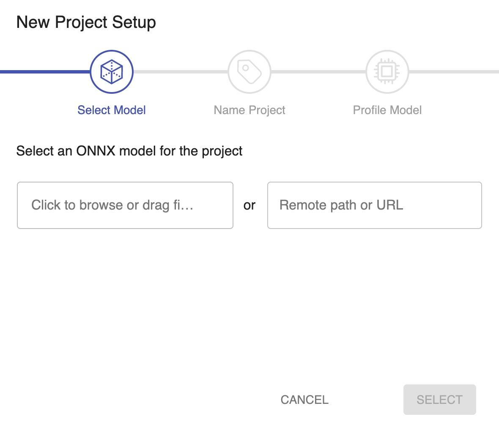
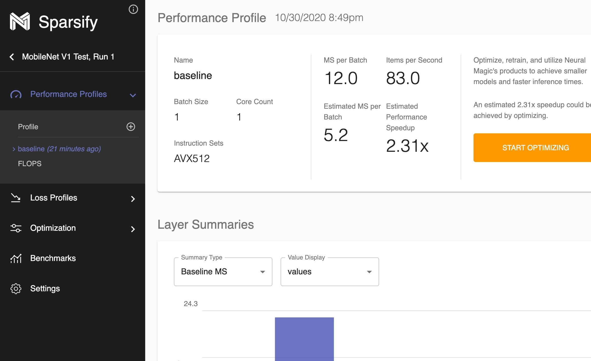
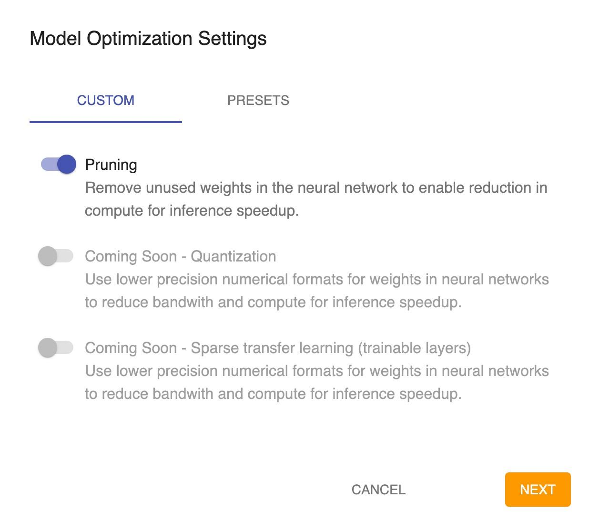

<!--
Copyright (c) 2021 - present / Neuralmagic, Inc. All Rights Reserved.

Licensed under the Apache License, Version 2.0 (the "License");
you may not use this file except in compliance with the License.
You may obtain a copy of the License at

   http://www.apache.org/licenses/LICENSE-2.0

Unless required by applicable law or agreed to in writing,
software distributed under the License is distributed on an "AS IS" BASIS,
WITHOUT WARRANTIES OR CONDITIONS OF ANY KIND, either express or implied.
See the License for the specific language governing permissions and
limitations under the License.
-->

## Quick Tour

A console script entry point is installed with the package: `sparsify`.
This enables easy interaction through your console/terminal.
Note, for some environments the console scripts cannot install properly.
If this happens for your system and the `sparsify` command is not available,
`scripts/sparsify.py` may be used in its place.

To launch Sparsify locally, open up a console or terminal window and type in the following:

```bash
sparsify
```

The Sparsify server will begin running locally on the machine and can be accessed through a web browser.
The default host:port Sparsify starts on is `0.0.0.0:5543`.
Therefore, after starting Sparsify with the default commands, you may enter the following into a web browser to begin using Sparsify: `http://0.0.0.0:5543`.

If you are running Sparsify on a separate server from where the web browser is located,
then you will need to substitute in the proper IP address for that server in place of `0.0.0.0`.
Additionally, confirm that the networking rules on your server allow for access to port 5543.

After visiting `http://0.0.0.0:5543` in a web browser, the home page for Sparsify will load if configured correctly:


A quick start flow is given below. For a more in-depth read, check out the [Sparsify User Guide](userguide/index).

### New Project

To begin optimizing a model, a new project must be created.
The New Project button is located in the lower right of Sparsify's home screen.
After clicking, the create project popup will be displayed:


Sparsify only accepts [ONNX](https://onnx.ai/) model formats currently.
To easily convert to ONNX from common ML frameworks, see the [SparseML repository](https://github.com/neuralmagic/sparseml).

To begin creating a project use one of the following flows:

- Upload your model file through the browser by clicking on `Click to browse`.
- Download your model file through a public URL by filling in the field `Remote Path or URL`.
- Move your model file from an accessible file location on the server by filling in the field `Remote Path or URL`.

Continue through the popup and fill in information as specified to finish creating the project.

### Analyzing a Model

After model creation, optimization sensitivity analysis for the model are shown under the `Performance Profiles` and `Loss Profiles` in the left navigation.

The profiles will show the effects that different types of optimizations and degrees of those optimizations have on both the models inference speed and the baseline loss.

Performance Profiles:


Loss Profiles:


### Optimizing a Model

Click on the `Optimization` in the left navigation or the `Start Optimizing` button on the analyzing pages to begin optimizing your model. After clicking, the optimization creation popup will be displayed:


Fill in the information as required in the modal.
Once completed, Sparsify's autoML algorithms will choose the best settings it can find for optimizing your model.
The resulting recipe will be displayed along with estimated metrics for the optimized model.
The recipe can then be further edited if desired:


### Exporting a Recipe

Currently Sparsify is focused on training-aware optimizations; 
these allow much better loss recovery for a given target performance.
A future release will enable the option of one-shot optimizations with limited to no retraining.

Given that the optimization recipe is created with training-aware optimizations, it must be exported for inclusion in your original training pipeline using [SparseML](https://github.com/neuralmagic/sparseml).
SparseML enables this inclusion with only a few lines of code for most training workflows.

On the optimization page, click the `Export` button in the bottom right.
This will open up the export popup:


Select the framework the model was originally trained in on the upper right of the popup.
Once selected, either copy or download the recipe for use with SparseML.
In addition, some sample code using SparseML is given to integrate the exported optimization recipe.