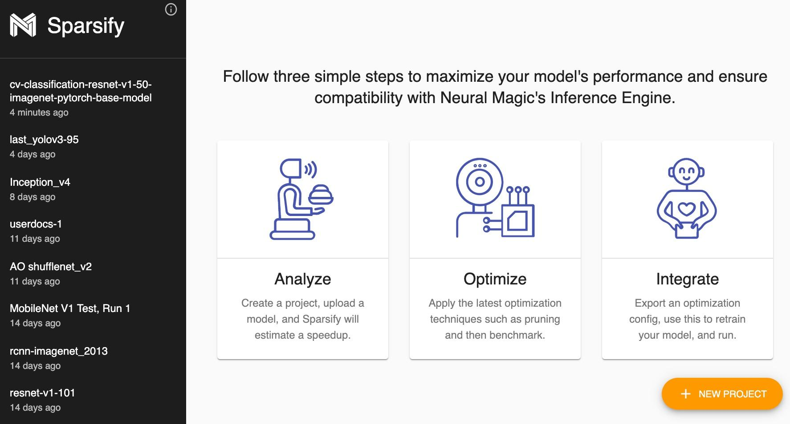
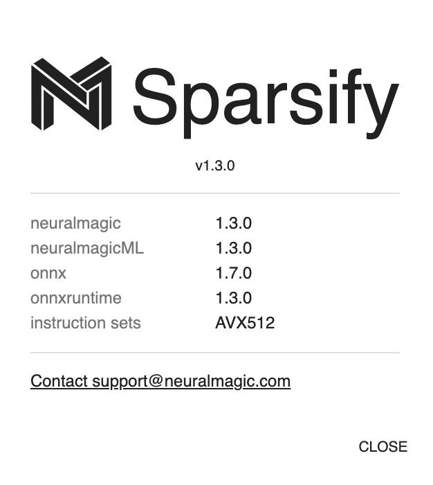

<!--
Copyright (c) 2021 - present / Neuralmagic, Inc. All Rights Reserved.

Licensed under the Apache License, Version 2.0 (the "License");
you may not use this file except in compliance with the License.
You may obtain a copy of the License at

   http://www.apache.org/licenses/LICENSE-2.0

Unless required by applicable law or agreed to in writing,
software distributed under the License is distributed on an "AS IS" BASIS,
WITHOUT WARRANTIES OR CONDITIONS OF ANY KIND, either express or implied.
See the License for the specific language governing permissions and
limitations under the License.
-->

# Installing and Launching Sparsify

To install Sparsify, run:

```bash
pip install sparsify
```

To launch Sparsify, type the following command:

```bash
sparsify
```

Optionally, you can run `sparsify -h` to get more options.

## From the Start screen, you can

<kbd></kbd>

### Start a new project

The New Project button initiates the start of a new project during which you will analyze, optimize, and integrate your model to maximize performance and ensure compatibility with optionally, Neural Magic's DeepSparse Engine.

### Open an existing project

Projects are listed in a navigation bar (black area) on the left of the Start page. You can create a single or multiple projects for your analysis.

### Display additional information

An information <kbd></kbd> button is available in the upper right of the navigation bar to display information about Sparsify.

<kbd></kbd>

---
**Next step...**

Go deeper on details with the [Sparsify Overview](https://docs.neuralmagic.com/archive/sparsify/main/source/userguide/03-sparsify-overview.html).
