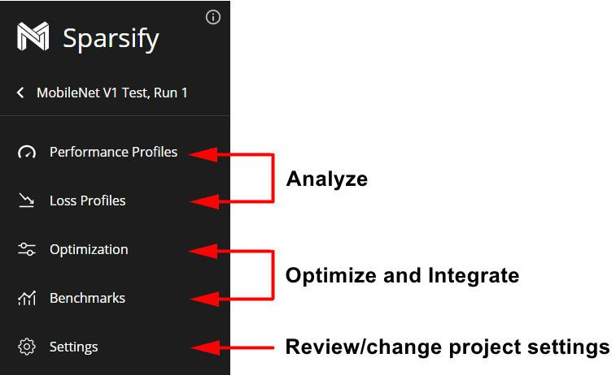
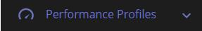

<!--
Copyright (c) 2021 - present / Neuralmagic, Inc. All Rights Reserved.

Licensed under the Apache License, Version 2.0 (the "License");
you may not use this file except in compliance with the License.
You may obtain a copy of the License at

   http://www.apache.org/licenses/LICENSE-2.0

Unless required by applicable law or agreed to in writing,
software distributed under the License is distributed on an "AS IS" BASIS,
WITHOUT WARRANTIES OR CONDITIONS OF ANY KIND, either express or implied.
See the License for the specific language governing permissions and
limitations under the License.
-->

# Sparsify Overview

Sparsify involves three simple steps:

## 1. Analyze

Create a project and upload your model. Sparsify will estimate performance improvements and model compression potential. During analysis, your goals are to:

- Open an existing project, or create a new project by uploading an ONNX version of your model.

- Profile your model for the effects of model optimizations on performance and loss.

## 2. Optimize

Use the Sparsify automatic model optimization algorithms to apply the latest techniques to make your model smaller and run faster. Sparsify enables you to optimize using pruning, and quantization (future), and sparse transfer learning (future). During optimization, your goals are to:

- Create and modify a model optimization configuration.

- Optionally, benchmark the model to get measured (rather than estimated) values.

## 3. Integrate

Export a configuration (yml) file and integrate code into your training workflow. This minimizes the work needed for you to quickly retrain your model to put Sparsify optimizations into practice. During integration, your goals are to:

- Export the configuration and integrate it into your current training flow.

- Include Sparsify-generated integration and/or training code into your current training flow.

While *analyzing* and *optimizing* a model, five work sections are provided in the navigation bar for each project:

<kbd></kbd>

When a section is active, it changes color. For example:

<kbd></kbd>

**Performance Profiles** provide an indication of the effect of model optimizations on the inference performance of the model. In addition, they provide detailed performance information for the model without any optimizations.

**Loss Profiles** provide an indication of the effect of optimization on the loss. A loss profile shows 1) how each layer responds to and is affected by optimization sensitivity such as pruning and 2) how many parameters there are in the model.

**Optimization** applies the latest techniques to make your model run faster. Once satisfied with the optimization, you can export a configuration (yml) file and integrate code into your training.

**Benchmarks** provide measured (rather than estimated) values. After running a benchmark, you might want to change optimization values and run an optimization profile again.

**Settings** for your model project are listed. You can review/change settings at any time.

---
**Next step...**

Begin by [analyzing](https://docs.neuralmagic.com/archive/sparsify/source/userguide/04-analyze.html) your model.
