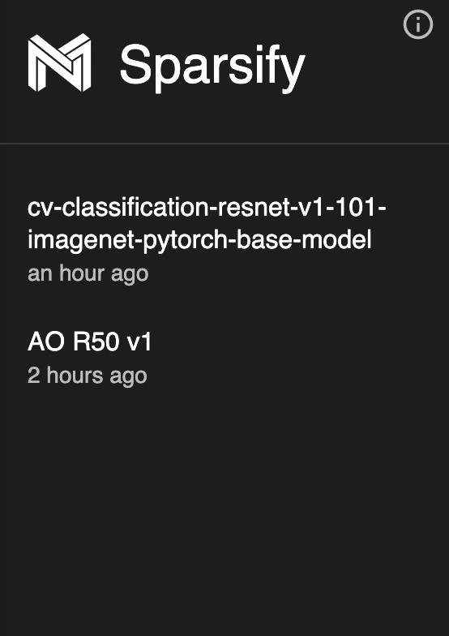
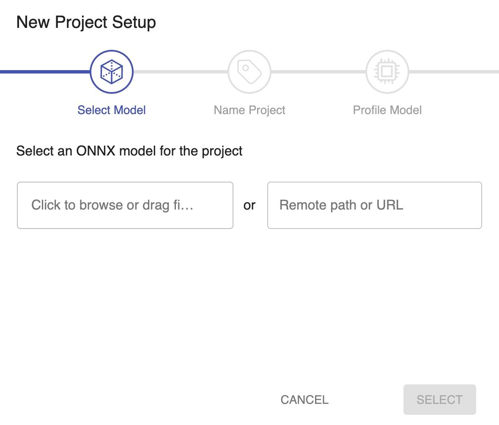
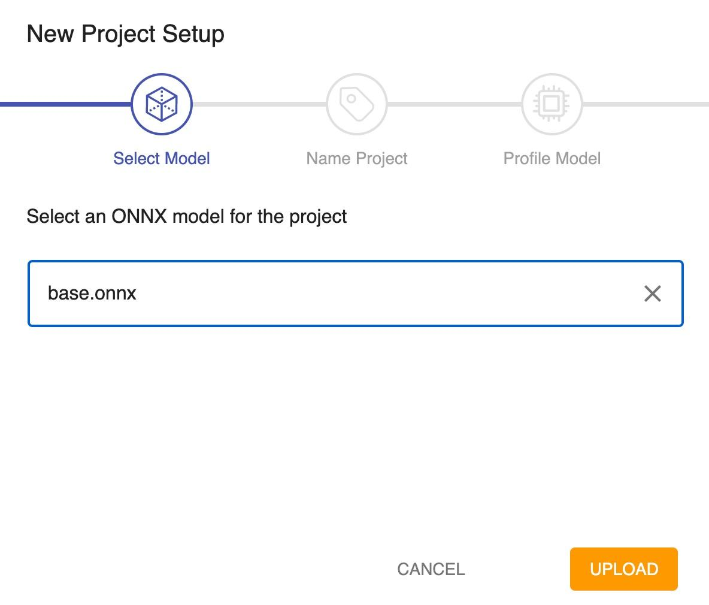
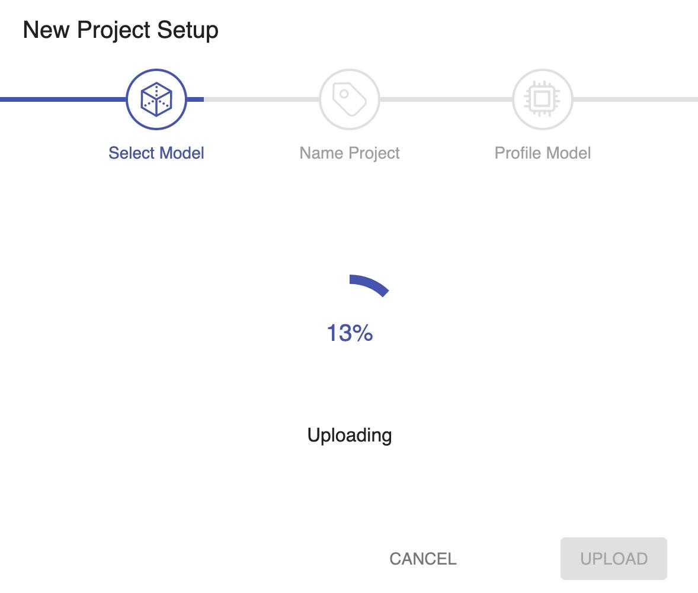
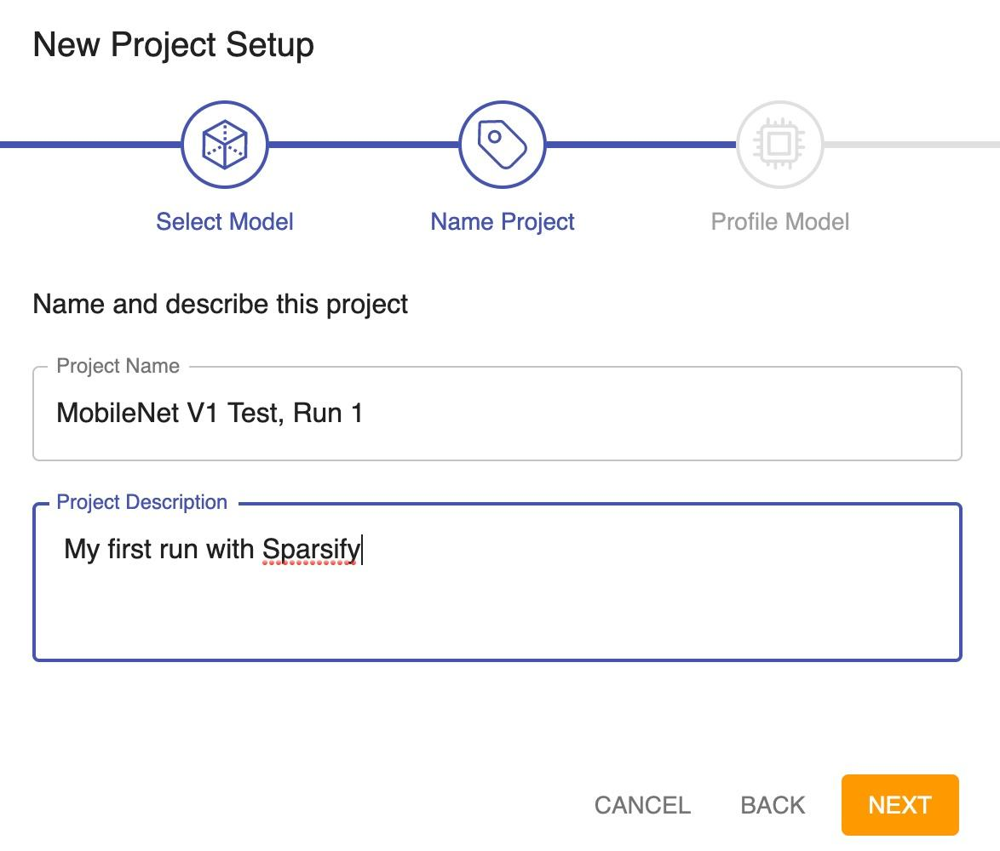

<!--
Copyright (c) 2021 - present / Neuralmagic, Inc. All Rights Reserved.

Licensed under the Apache License, Version 2.0 (the "License");
you may not use this file except in compliance with the License.
You may obtain a copy of the License at

   http://www.apache.org/licenses/LICENSE-2.0

Unless required by applicable law or agreed to in writing,
software distributed under the License is distributed on an "AS IS" BASIS,
WITHOUT WARRANTIES OR CONDITIONS OF ANY KIND, either express or implied.
See the License for the specific language governing permissions and
limitations under the License.
-->

# Analyze

During analysis, you will profile (understand) your model. Profiling is a unique Sparsify feature that does a layer-by-layer analysis of the model by looking at loss and performance. Rather than simply estimating, profiling determines which parts of your model contribute to performance and which parts contribute to loss. For example, if you optimize the model and cut out one layer completely, how much will that affect the loss? And, how much is that going to affect the performance? This information is valuable to know before you begin to optimize. It guides the automatic optimization algorithms.

During analysis, your goals are to:

- Open an existing project, or create a new project by uploading an ONNX version of your model.

- Profile your model for the effects of model optimizations on performance and loss.

## Opening an Existing Project

Existing projects are listed by name in the navigation bar on the left side of the screen. Just click on a project name to open it.

<kbd></kbd>

## Creating a New Project

Follow this procedure to set up a new project. You will select an ONNX* model configuration file, name the project, and profile the model (based on batch size and cores).

- [ONNX](https://onnx.ai/) (Open Neural Network Exchange) is an open-source artificial intelligence ecosystem. Model data that is the ONNX format is easily passed to the DeepSparse Emgine to get inference results. Sparsify accepts only ONNX files.

If further instructions are needed, consult the [SparseML's documentation on Exporting to ONNX](https://docs.neuralmagic.com/sparseml/) for PyTorch and TensorFlow.

1. Click **NEW PROJECT**.

2. Start a new project in one of several ways:

    - Click to browse or drag a local ONNX file of the model to load. You can browse to or drag from the computer that is currently running Sparsify in the browser.

    - Click to enter a remote server path or URL for an ONNX file. A remote server path is anywhere that the "sparsify" command was originally entered to start the server.

    <kbd></kbd>

    **Note**: Click **CANCEL** at any time if you want to end the new project procedure. You will be returned to the Start page.

3. Once you select the model (base.onnx, in this example)....

    <kbd></kbd>

    click **UPLOAD** to upload the model file.

    <kbd></kbd>

4. When a local file is uploaded, the name of the file is automatically displayed as the project name. If you upload a model file from a URL, the name field will be empty and the project will be listed as "unspecified" in the project list. In either case, you can change this name and/or enter a project description. You can use alphanumeric characters, special characters, and spaces.

    The project name is used throughout Sparsify as a reference to your model. For example, if you create multiple projects using the same model, unique project names will enable you to differentiate.

    **Note:** You can change the project name at any time by returning to this dialog or by changing the name in the [Settings](https://docs.neuralmagic.com/archive/sparsify/main/source/userguide/07-settings.html).

    <kbd></kbd>

    **Note:** Click BACK if you want to return to the previous dialog.

5. Click **NEXT**.

6. Continue by [Profiling Your Model](https://docs.neuralmagic.com/archive/sparsify/main/source/userguide/04a-profiling-your-model.html).
