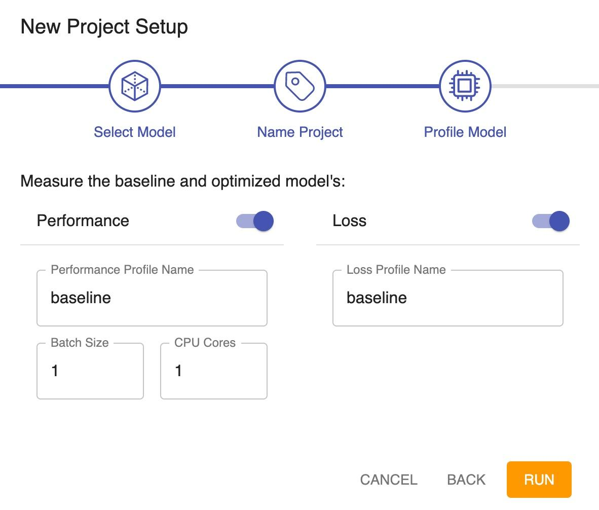
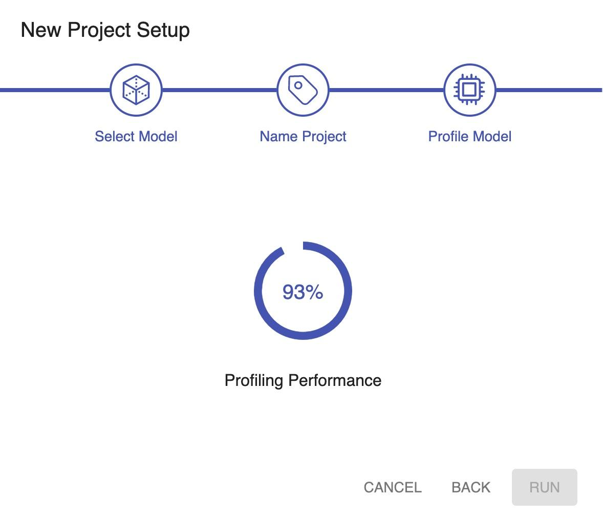
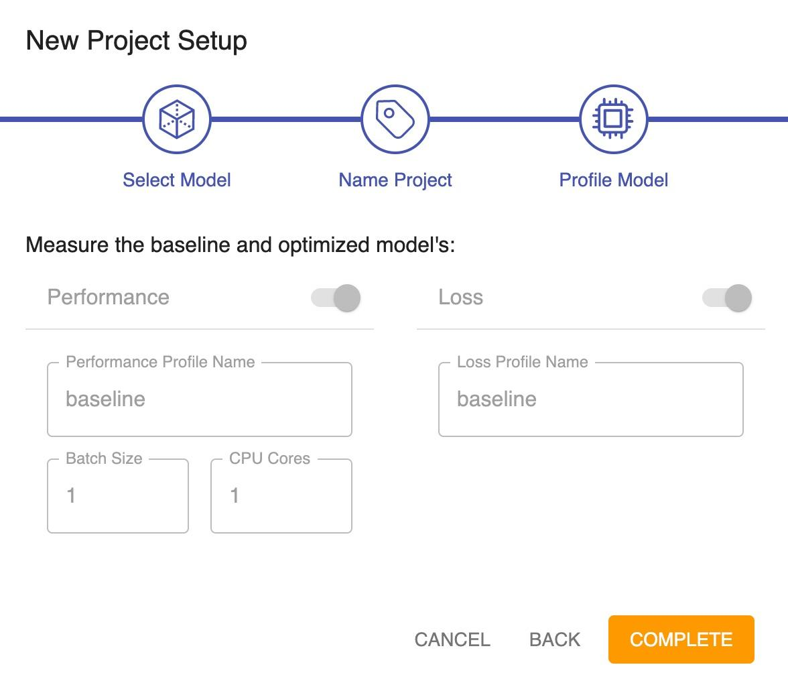

<!--
Copyright (c) 2021 - present / Neuralmagic, Inc. All Rights Reserved.

Licensed under the Apache License, Version 2.0 (the "License");
you may not use this file except in compliance with the License.
You may obtain a copy of the License at

   http://www.apache.org/licenses/LICENSE-2.0

Unless required by applicable law or agreed to in writing,
software distributed under the License is distributed on an "AS IS" BASIS,
WITHOUT WARRANTIES OR CONDITIONS OF ANY KIND, either express or implied.
See the License for the specific language governing permissions and
limitations under the License.
-->

# Profiling Your Model

Profiling is used to determine how optimization will affect performance and loss.

- A performance profile provides an indication of the effect of model optimizations on the inference performance of the model. In addition, it provides detailed performance information for the model without any optimizations. The profile looks at a detailed view of how fast each layer is running and how much time it is taking as well as how much time can be optimized.

- A loss profile is an indication of the effect of optimization on the loss. It shows how each layer is likely to affect the loss when model optimizations such as pruning are applied to it. The loss profile also shows how many parameters there are in the model.

    <kbd></kbd>

    **Note:** If you change information on this dialog and then click **BACK**, the changes are retained when you return to this dialog.

1. You can select both Performance and Loss for profiling. In general, both should be run and, as such, both are selected by default.

    You may opt to disable the Performance option if the model is large and will require numerous executions that will take considerable time. In this case, the performance profile will be approximated from the architecture as a FLOPS (floating point operations per second) profile. A FLOPS profile is a theoretical measure of performance.

    If you are just [benchmarking](https://docs.neuralmagic.com/archive/sparsify/main/source/userguide/05a-benchmark.html) the model, you may disable both the Performance and Loss options. In this case, both profiles will be approximated from the architecture.

2. Enter names for the performance and loss profiles. These names will be referenced throughout Sparsify to quickly identify your profiles.

3. Further describe the Performance profile for the target deployment:

    - Batch size of the inputs to be used with the model. For example, you might enter 1 if you are running real-time object detection. If you are running a throughput use case, batch size depends on your domain and use case (64 is common for image classification).

    - Number of CPU cores on which to run the model.

    You should enter the batch size and core count to which you will deploy. Sparsify will run with this batch size and core count and apply the optimizations to the model to see how the performance is being changed. Batch size and core count can affect how Sparsify runs the model and how fast it is run; therefore, they affect how Sparsify optimizes the model.

    **Note:** Eventually, you might want to run multiple performance profiles by [Adding a New Performance Profile](https://docs.neuralmagic.com/archive/sparsify/main/source/userguide/04b-reviewing-performance-profiles.html#adding-a-new-performance-profile). For example, if you are unsure of how you will deploy, you might want to consider various optimization schemes. Or, you may want multiple performance profiles because you deploy a model in multiple ways (such as a throughput offline and latency online).

4. Click **RUN** and a message will indicate that the system is profiling the performance and/or loss.

    <kbd></kbd>

    When all metrics are generated, the New Project Setup dialog is grayed out. For example:

    <kbd></kbd>

5. Click **COMPLETE**. The performance profile will be displayed, as described in [Reviewing Performance Profiles](https://docs.neuralmagic.com/archive/sparsify/main/source/userguide/04b-reviewing-performance-profiles.html).

---
**Next steps...**

Continue by reviewing your [Performance Profiles](https://docs.neuralmagic.com/archive/sparsify/main/source/userguide/04b-reviewing-performance-profiles.html) and [Loss Profiles](https://docs.neuralmagic.com/archive/sparsify/main/source/userguide/04c-reviewing-loss-profiles.html).
Then, you will be ready to [Optimize](https://docs.neuralmagic.com/archive/sparsify/main/source/userguide/05-optimize.html).
