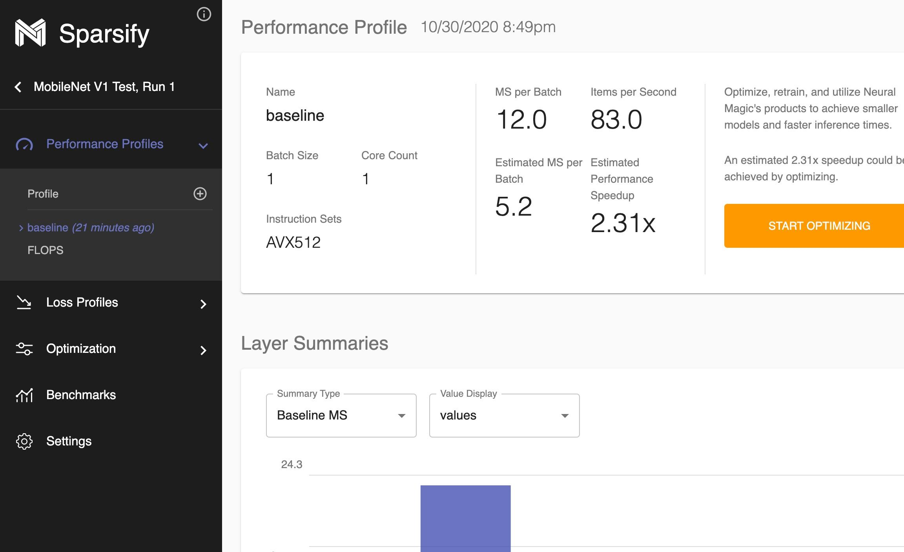
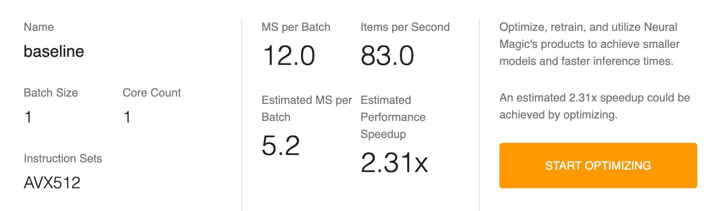
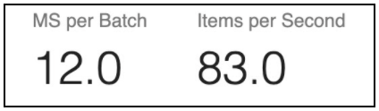
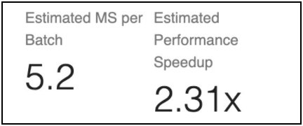
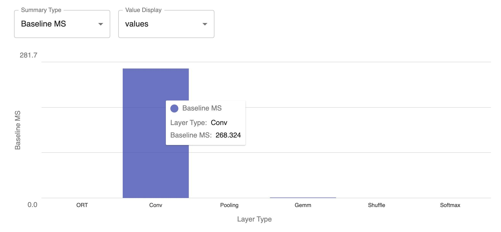
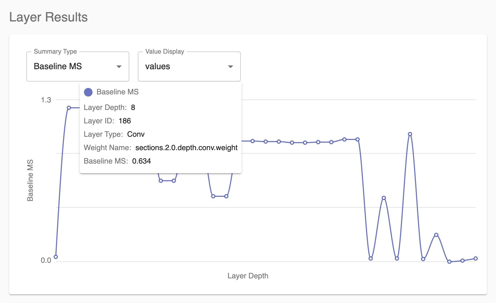
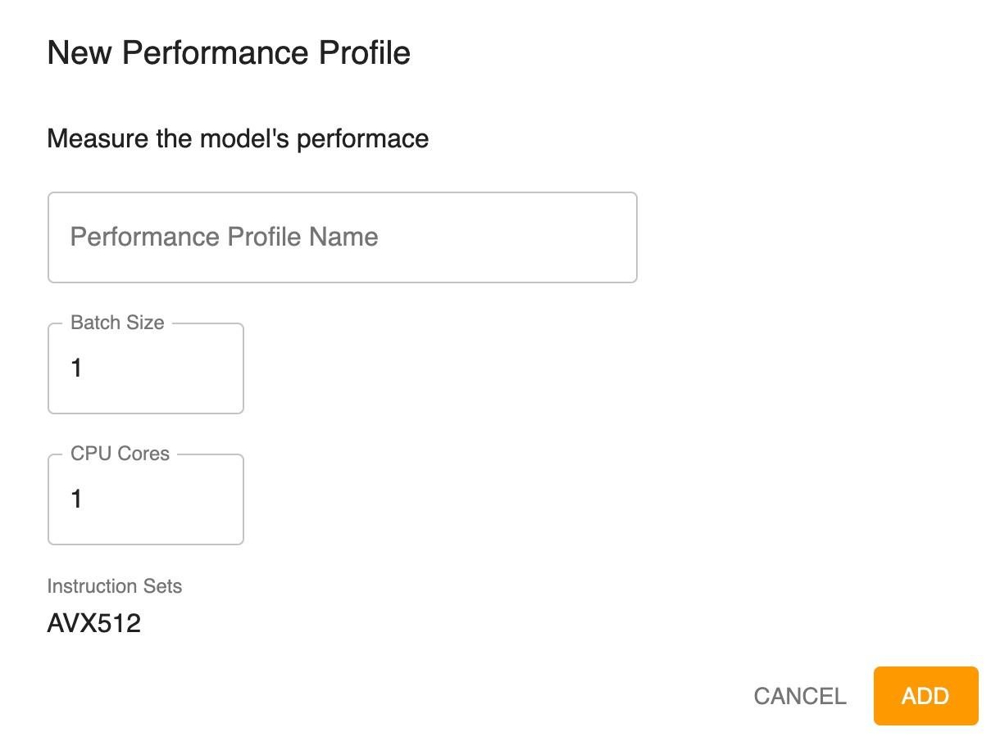

<!--
Copyright (c) 2021 - present / Neuralmagic, Inc. All Rights Reserved.

Licensed under the Apache License, Version 2.0 (the "License");
you may not use this file except in compliance with the License.
You may obtain a copy of the License at

   http://www.apache.org/licenses/LICENSE-2.0

Unless required by applicable law or agreed to in writing,
software distributed under the License is distributed on an "AS IS" BASIS,
WITHOUT WARRANTIES OR CONDITIONS OF ANY KIND, either express or implied.
See the License for the specific language governing permissions and
limitations under the License.
-->

# Reviewing Performance Profiles

The performance profile is tied to the batch size and core count. It is used to optimize, retrain, and utilize Neural Magic's DeepSparse Engine to achieve faster inference timings.

<kbd></kbd>

You might see two types of performance profiles listed in the Performance Profiles section of the navigation bar:

- "baseline" (the name entered on the New Project Setup dialog)—the profile that you defined, which includes measured values of how long it took to run your model as well as each layer in the model.

- FLOPS—a profile that is a theoretical measurement of performance based on the floating point operations per second profile. This graph always appears and indicates the compute-intensivity of your model. A larger model has more FLOPS, while a smaller model has fewer FLOPS. In general, a model with more FLOPS will take longer to run.

The Performance Profile consists of three sections:

- Model Summary

- Layer Summaries

- Layer Results

## Model Summary

The Model Summary provides information about the performance profile, including the batch size, core count, and instruction sets that were available when the profile was run.

<kbd></kbd>

The Model Summary also shows how fast the model ran and how fast Sparsify estimates that it can run when optimized.

<kbd></kbd>

Measured speed of the model when the profile was run indicates how fast the model runs currently through DeepSparse Engine. Timing information is displayed as milliseconds per batch and what that equates to as items per second.

<kbd></kbd>

Estimated speedup times (with limited effect on the loss) are indicated if model optimizations are applied. Timing information is displayed as estimated milliseconds per batch and the estimated performance speedup factor if the model is optimized.

The next portion of the screen enables you to visualize where the timing for your model is going.

## Layer Summaries

This graph shows where the majority of time is spent for different layer types.* This can help you determine if optimization will be helpful. It shows the potential speedup time or speedup percentage per layer type based on optimization.

- The layer types (operators) will vary based on the model.

**Note:** The specific layer types depend on the model that is loaded.

In the following example, most of the time is spent in convolution, and convolution is an area in which pruning can result in significant speedup. Conversely, if the graph showed that most of the time is spent in shuffle or other subgraphs, pruning would not help.

<kbd></kbd>

ORT indicates times that were not run through the DeepSparse Engine and instead went through ONNX runtime. ORT items do not get speedup.

The Summary Type is set as Baseline MS by default. This shows the results of running the model as fast as possible without optimization. Options are available to review the results based on measurements with different pruning values. For example, if you select Pruned 0.9 MS, the results are shown to represent 90% pruning (90% sparse, 10% dense) across the entire model.  

## Layer Results

This graph drills down deeper on a per node, per layer basis to see what was run and where time was spent on your model. You can look at the various optimizations that were run for profiling to determine which layer runs fastest and where there may be problems running the model. For example, if you see that two of the layers are each taking 20% of the time, you will want to either re-architect or extensively prune those layers to optimize the time.

<kbd></kbd>

Layer ID is the ONNX ID for the layer.

Weight name comes from the ONNX graph. It is held constant across ONNX and all the way back to the original framework (PyTorch or TensorFlow).

## Adding a New Performance Profile

You can identify a new performance profile:

1. Click the <kbd></kbd> icon in the Performance Profiles section of the navigation bar.

2. Enter the profile name.

3. You can change the batch size and/or CPU cores, which can affect the optimization and performance differently. Generally, larger batch sizes enable better efficiency in the engine for both sparse and dense models; therefore, throughput can be increased even more by increasing the batch size for most models.

4. Click **ADD**.

    <kbd></kbd>

---
**Next steps...**

Continue by reviewing your [Loss Profiles](https://docs.neuralmagic.com/archive/sparsify/main/source/userguide/04c-reviewing-loss-profiles.html).
Then, you will be ready to [Optimize](https://docs.neuralmagic.com/archive/sparsify/main/source/userguide/05-optimize.html).
