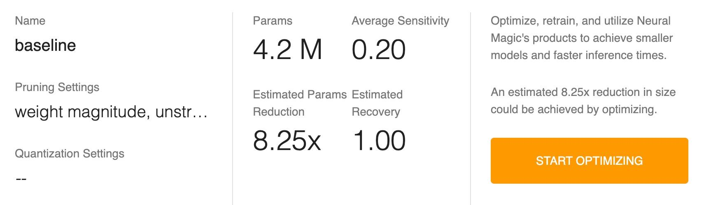

<!--
Copyright (c) 2021 - present / Neuralmagic, Inc. All Rights Reserved.

Licensed under the Apache License, Version 2.0 (the "License");
you may not use this file except in compliance with the License.
You may obtain a copy of the License at

   http://www.apache.org/licenses/LICENSE-2.0

Unless required by applicable law or agreed to in writing,
software distributed under the License is distributed on an "AS IS" BASIS,
WITHOUT WARRANTIES OR CONDITIONS OF ANY KIND, either express or implied.
See the License for the specific language governing permissions and
limitations under the License.
-->

# Reviewing Loss Profiles

A loss profile is an indication of the effect of model optimizations on the loss. It shows how each layer responds to and is affected by optimization sensitivity such as pruning. The loss profile also shows how many parameters there are in the model.

<kbd></kbd>

You might see two types of loss profiles listed in the Loss Profiles section of the navigation bar:

- "baseline" (the name entered on the New Project Setup dialog)—the profile that you defined, which indicates loss sensitivity and the number of parameters in the model.

- Approximated—a profile that is approximated from the architecture if you did not specify Loss during project setup.

The Loss Profile consists of three sections:

- Model Summary

- Layer Sensitivities

- Layer Params Counts

## Model Summary

The Model Summary provides information about the loss profile, including the pruning and quantization (future release) settings that were used when the profile was run.

<kbd></kbd>

The Model Summary also shows the total number of parameters and how much reduction Sparsify estimates as well as the loss sensitivity (an indication of how the model is affected by optimization) and estimated recovery (the estimated confidence in recovering the original loss of the model after retraining with the current model optimization).

Average sensitivity indicates the loss sensitivity of the entire model. The estimated recovery value shows the chance of recovering the loss completely.

<kbd></kbd>

The number of parameters (params) in a model corresponds to how well the model can be optimized. For example, if a model has a significant number of parameters, it will be very prunable because it is very redundant. The estimated parameters reduction shows how much model compression will result from optimization.

<kbd></kbd>

## Layer Sensitivities

The Layer Sensitivities graph shows pruning sensitivity measure values at each layer. You will see which layer is the most sensitive to pruning and which is the least sensitive. (The value for each layer is relative and not in an exact range.) When the graph shows that a layer affects the loss significantly, you may not want to prune that layer.

<kbd></kbd>

**Note:** When a model has more weights that are further from zero, the model is more sensitive to pruning.

## Layer Params Counts

This graph shows how many parameters are in each layer, which is important when you are trying to reduce the size of the model. In the following example, the last two layers make up many of the parameters in the network. So, you would want to include these layers (with the most parameters) for optimization as those are the layers that will have the most effect on size-reduction.

**Note:** There will be a rough correlation between the sensitivity and the number of parameters in a layer. A layer with fewer parameters will be more sensitive.

<kbd></kbd>

### Adding a New Loss Profile

You can identify a new loss profile:

1. Click the <kbd></kbd> icon in the Loss Profiles section of the navigation bar.

2. Enter the profile name.

3. Click **ADD**.

<kbd></kbd>

---
**Next steps...**

Continue by reviewing your [Performance Profiles](https://docs.neuralmagic.com/archive/sparsify/main/source/userguide/04b-reviewing-performance-profiles.html) if you have not already done so.
Then, you will be ready to [Optimize](https://docs.neuralmagic.com/archive/sparsify/main/source/userguide/05-optimize.html).
