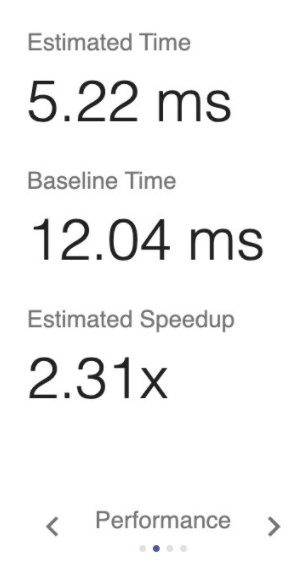

<!--
Copyright (c) 2021 - present / Neuralmagic, Inc. All Rights Reserved.

Licensed under the Apache License, Version 2.0 (the "License");
you may not use this file except in compliance with the License.
You may obtain a copy of the License at

   http://www.apache.org/licenses/LICENSE-2.0

Unless required by applicable law or agreed to in writing,
software distributed under the License is distributed on an "AS IS" BASIS,
WITHOUT WARRANTIES OR CONDITIONS OF ANY KIND, either express or implied.
See the License for the specific language governing permissions and
limitations under the License.
-->

# Optimize

After you analyze your model, you are ready to make optimizations on it. When you apply model optimizations (such as pruning), retraining the model is required. During model optimization, you will use Sparsify to apply the latest techniques to make your model run faster. Your goals are to:

- Create and edit an automatic model optimization configuration using one of the Sparsify techniques:

  - Pruning

  - Quantization (future)

  - Sparse transfer learning (future)

- Optionally, benchmark the model to get measured (rather than estimated) values.

## Running Sparsify for Model Optimization

There are two ways to use model optimization settings:

- Custom—Pruning, Quantization (future), or Sparse transfer learning (future)

- Presets (future)

  <kbd></kbd>

    **Note:** If you already ran optimization for your model, you will not see these options. Instead, the [Optimization screen](#pruning-modifier) will be displayed.

To run Sparsify for optimization:

1. Select your optimization choice and click **Next**.

2. To help Sparsify set up a pruning profile, indicate how you trained your model. Select:

    - Optimizer used.

    - Number of epochs used for your original training. This value must be greater than 1 and is generally 20 or greater.

    - Learning rate range that you used for training. The Initial LR should be less than 1 and the Final LR must be less than the Initial LR.

    For example:

    <kbd></kbd>

3. Click **APPLY**.

    **Note:** If you need to change these settings in the future, you can do so by changing the [Settings](https://docs.neuralmagic.com/archive/sparsify/main/source/userguide/07-settings.html). However, changing these values later will not change the modifiers on the Optimization screen.

The Optimization screen is displayed. For example:

<kbd></kbd>

The Optimization screen consists of three sections:

- Pruning Modifier

- Learning Rate Modifier (displayed only if you entered the learning rates)

- Training Summary

### Pruning Modifier

The Pruning Modifier represents the sparsity profile, which shows all of the modifications that will be done to the training process to make it faster. For example:

<kbd></kbd>

The graph provides a visual of the modifier—the sparsity across all the layers in the model. This gives you a sense of what is changing. Tooltips provide additional information at each layer.

Values on the left of this section show the modifier results—what is expected to happen during optimization. You want to see as much speedup as possible. Below the values, notice that you can scroll through the following to see different types of information:

- Summary

    <kbd></kbd>

    **Recovery Confidence** is the estimated chance of recovering the original accuracy of your model after pruning. Recovery Confidence compares the sparsity values with the optimal for loss use case. This value should be as close to 1 as possible (or greater than 1).

- Performance

    <kbd></kbd>

- FLOPS

    <kbd></kbd>

- Params

    <kbd></kbd>

Pruning settings and the active epoch range are displayed to the right of the graph.

<kbd></kbd>

The average sparsity is displayed. You can use the slider to redistribute the sparsity across all layers to determine what will provide the best performance and the best chance for recovery. As you move the sparsity slider, you will see instant feedback in the measurement values and the graph. You will see changes in the estimated speedup, time, and recovery confidence. This gives you a relative sense of how much better the profile is. Sparsify redistributes the average sparsity for the model such that layers that affect the loss less and performance more are pruned to a higher level than others.

Click the <kbd></kbd> icon to see additional pruning settings. You can filter the layers by adjusting the minimum sparsity, minimum speedup, and/or minimum recovery. In addition, you can establish the optimization balance between performance and recovery.

<kbd></kbd>

The active epoch range indicates when pruning will be active while training. The specified range affects accuracy and loss. If the range starts at 1 and ends at 31, pruning will run from epochs 1 through 31. The update frequency indicates the pruning steps taken (how often pruning occurs) while training. For example, if the update frequency is set to 1, pruning will take place once every epoch. If the update frequency is set to 0.5, pruning will take place at a rate of twice per epoch.

<kbd></kbd>

*Pruning Editor*

Click <kbd></kbd> to access the Pruning Editor.

<kbd></kbd>

The table below the graph lists information for all layers. You can open each layer for more detail that you can adjust for optimization on a layer-by-layer basis. You can click  to display more detail for a layer. For example:

<kbd></kbd>

### Learning Rate Modifier

This section is displayed only if you entered the learning rates on the Model Optimization Settings dialog.

When you apply model optimizations (such as pruning), retraining the model is required. So, the learning rate modifier indicates (as you are training) how the system will control the learning rate for that training process. The graph represents a set learning rate schedule. It shows that at each learning rate step, increasingly fine-grained details of the model are learned.

<kbd></kbd>

These values apply to the learning rate range when retraining the model. The initial learning rate value corresponds to the starting epoch and the final learning rate corresponds to the ending epoch.

<kbd></kbd>

*Learning Rate Editor*

The recovery confidence is closely tied to the learning rate range. You can adjust learning rate information and save multiple schedules.

Click <kbd></kbd> to access the Learning Rate Editor. For example:

<kbd></kbd>

<kbd></kbd> (to the right of a schedule) removes the schedule.

<kbd></kbd> (at the top right of the learning rate schedules table) adds a learning rate schedule.

<kbd></kbd>  saves the schedule.

<kbd></kbd> removes the current settings.

### Training Summary

The training summary lays out all of the modifiers that are running and when those modifiers are active while you are training. In the following example, the pruning modifier is active during the pruning stage from epochs 1 to 31, and the learning rate modifier is active throughout the training (epochs 0 to 53) during the stabilization, pruning, and fine-tuning stages.

<kbd></kbd>

## Exporting

When you are satisfied with the optimization setting, click the **EXPORT** button to export a configuration file and integrate code into your training, as described in the [Integrate](https://docs.neuralmagic.com/archive/sparsify/main/source/userguide/06-integrate.html) section.

---
**Next steps...**

Continue by [Benchmarking](https://docs.neuralmagic.com/archive/sparsify/main/source/userguide/05a-benchmark.html).
Otherwise, you are ready to [Integrate](https://docs.neuralmagic.com/archive/sparsify/main/source/userguide/06-integrate.html).
