<!--
Copyright (c) 2021 - present / Neuralmagic, Inc. All Rights Reserved.

Licensed under the Apache License, Version 2.0 (the "License");
you may not use this file except in compliance with the License.
You may obtain a copy of the License at

   http://www.apache.org/licenses/LICENSE-2.0

Unless required by applicable law or agreed to in writing,
software distributed under the License is distributed on an "AS IS" BASIS,
WITHOUT WARRANTIES OR CONDITIONS OF ANY KIND, either express or implied.
See the License for the specific language governing permissions and
limitations under the License.
-->

# Benchmarking

You can benchmark the model to get measured (rather than estimated) values. After running a benchmark, you might want to change optimization values and run the new benchmark.

You can also use the benchmark to compare the results from two engines. This will enable you to determine which engine is appropriate for your business criteria.

**Note:** If you have not yet run a benchmark, you can continue by doing so as described below. If you already ran a benchmark(s), it will be displayed.

## Running the Benchmark of a Single Inference Engine

1. Click **ADD BENCHMARK**.

    <kbd>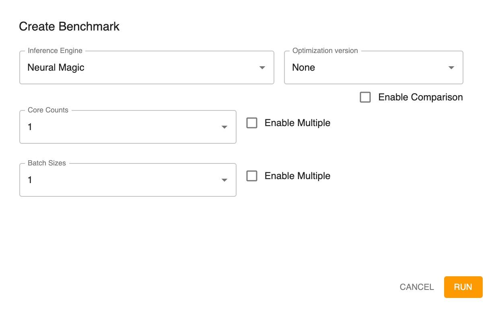</kbd>

2. Create a benchmark by indicating the inference engine to use for the benchmark, a benchmark that you want to compare to (optional, as described in [Running a Comparative Benchmark](#running-a-comparative-benchmark), optimization version (optional), core counts, and batch sizes.

    **Note:** Selecting the inference engine as ONNX Runtime CPU disables core count comparison.

    **Note:** You can select multiple core counts and/or batch sizes by checking the Enable Multiple option. For example:

    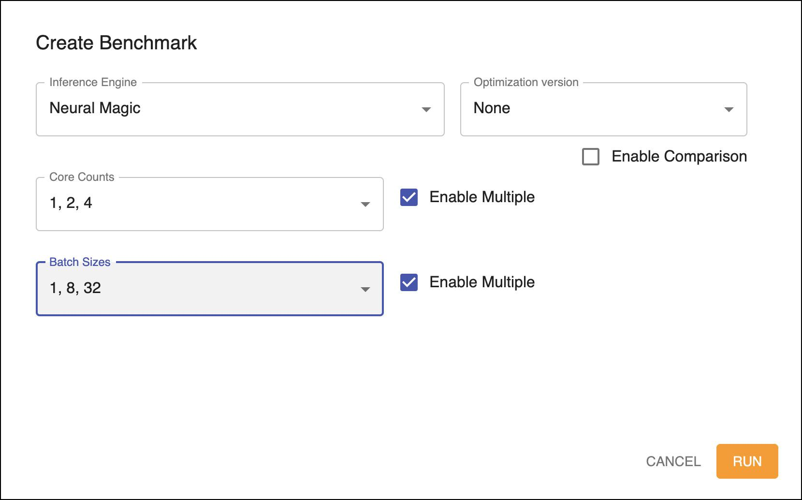

3. Click **RUN**.

Using the specified engine, a benchmark is run for the batch size(s) and core count(s) that you selected.

<kbd>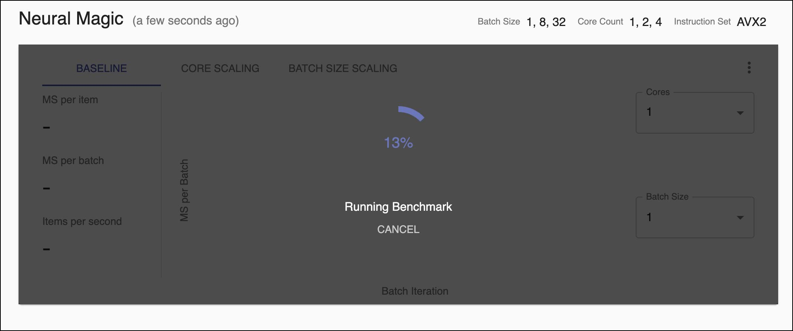</kbd>

Then, the Metric information is displayed. Here is an example of a benchmark with three batch sizes and three core counts specified:

<kbd>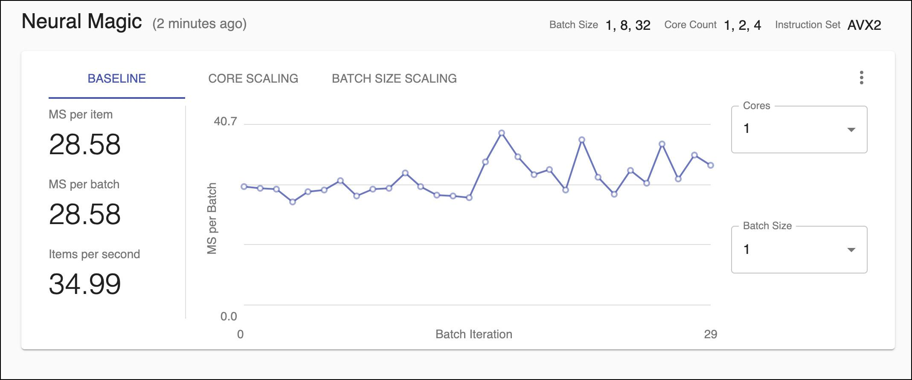</kbd>

If you run a benchmark with multiple batch sizes and/or core counts, all of the scenarios are examined. You can display the resulting information based on the baseline, core scaling, or batch size scaling. Here is an example of baseline information:

<kbd>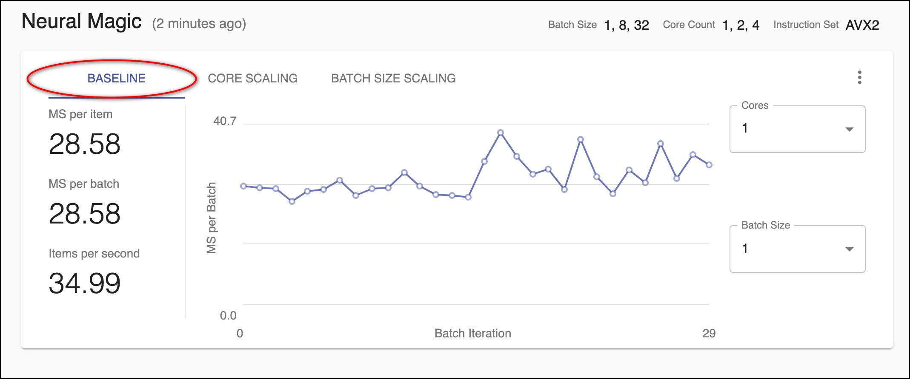</kbd>

You can select the cores and/or batch size on the right to see different scenarios.

If you display based on core scaling, the information shows the average values at different core counts with a fixed batch size.

<kbd>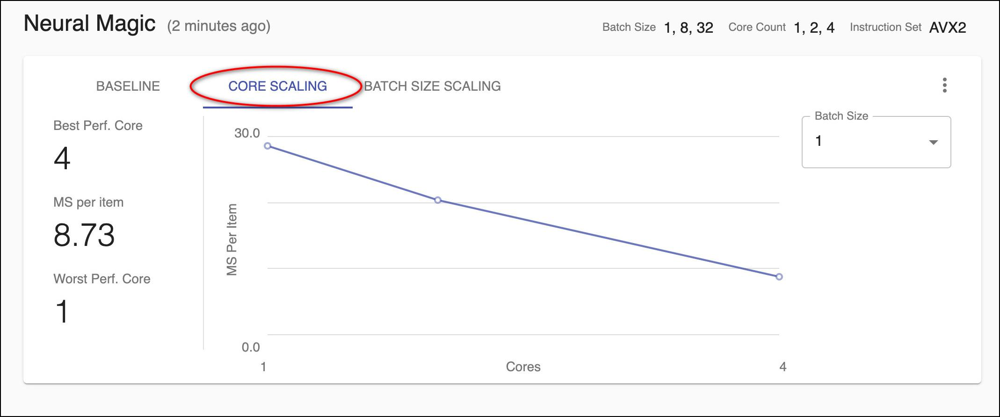</kbd>

You can change the batch size with the drop-down on the right to see the different scenarios. For example:

<kbd>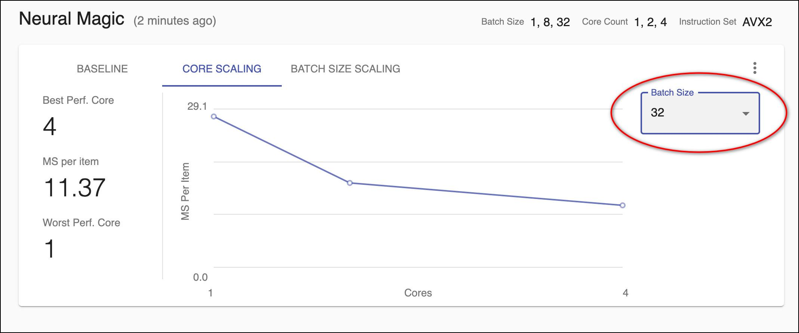</kbd>

If you display based on batch size scaling, the information shows the average values at different batch sizes with a fixed core count.

<kbd>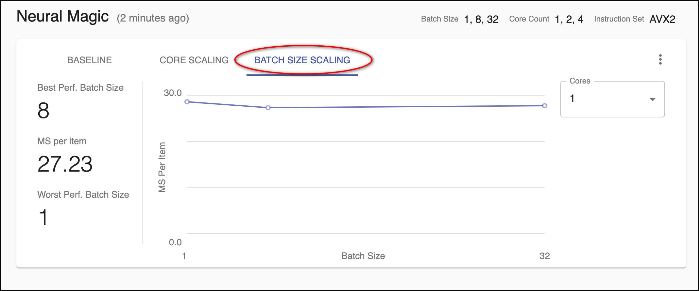</kbd>

You can change the core count with the drop-down on the right to see the different scenarios. For example:

<kbd>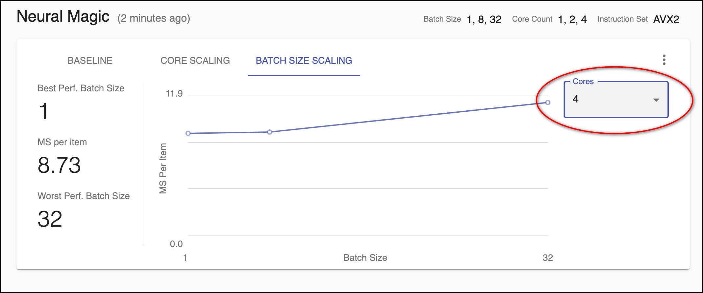</kbd>

As you add benchmarks, they are displayed starting with the most recent and sorted in chronological order. For example:

<kbd>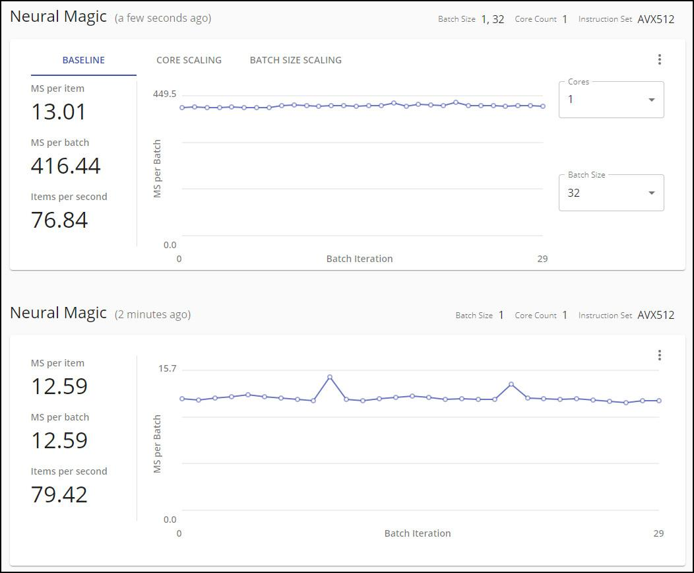</kbd>

## Running a Comparative Benchmark

You can run a benchmark and indicate that you want to compare it to another, existing benchmark.

<kbd>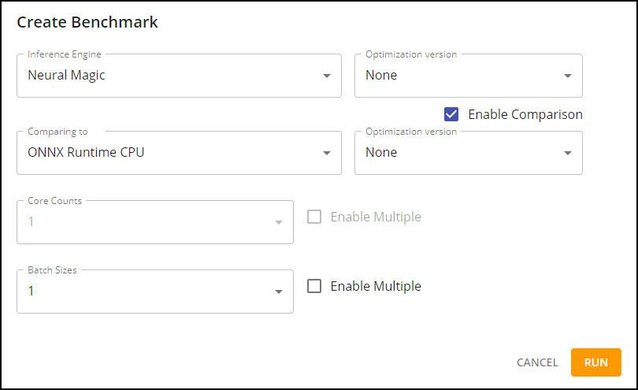</kbd>

The benchmark shows a comparative graph.

<kbd>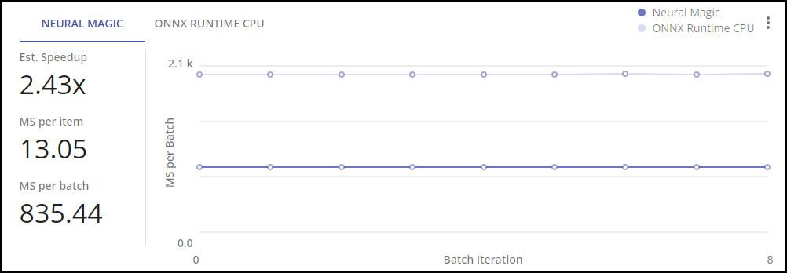</kbd>

You can display based on either engine:

<kbd>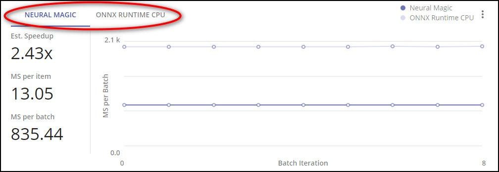</kbd>

## Re-Running a Benchmark

You can re-run a specific benchmark using the same conditions used for the original run. This will create a new benchmark with the same settings.

Click the <kbd></kbd> menu button and then **Re-run Benchmark**.

## Removing a Benchmark

Click the <kbd></kbd> menu button and then **Remove**.

---
**Next step...**

Depending on the results of your benchmarks, you may want to [Optimize](https://docs.neuralmagic.com/archive/sparsify/main/source/userguide/05-optimize.html) again or [Integrate](https://docs.neuralmagic.com/archive/sparsify/main/source/userguide/06-integrate.html).
