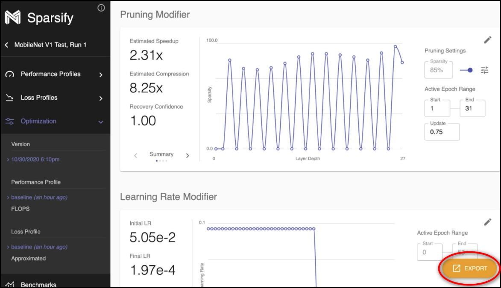
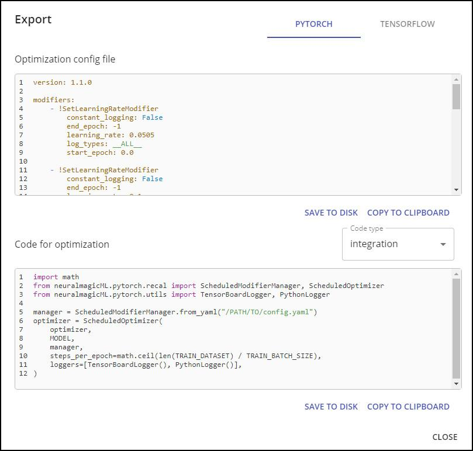

<!--
Copyright (c) 2021 - present / Neuralmagic, Inc. All Rights Reserved.

Licensed under the Apache License, Version 2.0 (the "License");
you may not use this file except in compliance with the License.
You may obtain a copy of the License at

   http://www.apache.org/licenses/LICENSE-2.0

Unless required by applicable law or agreed to in writing,
software distributed under the License is distributed on an "AS IS" BASIS,
WITHOUT WARRANTIES OR CONDITIONS OF ANY KIND, either express or implied.
See the License for the specific language governing permissions and
limitations under the License.
-->

# Integrate

After you optimize your model, click the **EXPORT** button on the Optimization screen to initiate the integration process.

<kbd></kbd>

During integration, you will generate a configuration (yml) file and integrate code into your training. This minimizes the work needed for you to train. The configuration file includes descriptions ("modifiers") of how the model will be modified during training. These modifiers correspond to modifiers in the [SparseML code base](https://github.com/neuralmagic/sparseml/). You can integrate the configuration file with your existing training platform and do not need to rewrite any part of your platform for optimization.

<kbd></kbd>

Your goals are to:

- Export the configuration file.

- Include Sparsify-generated integration and/or training code into your current training flow.

You can choose the PyTorch or TensorFlow framework, and the file code will change accordingly.

---
**Next step...**

Explore the [Optimization Config File and Code for Optimization](https://docs.neuralmagic.com/archive/sparsify/main/source/userguide/06a-optimize-config.html).
