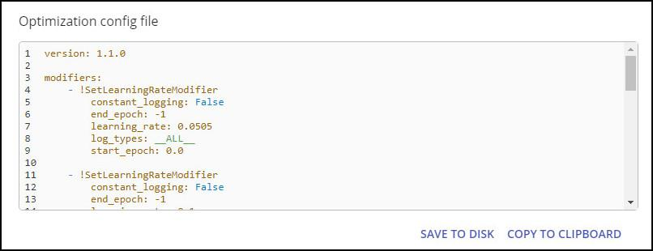
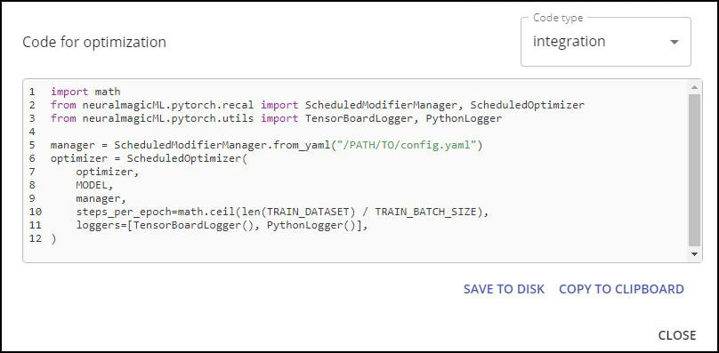

<!--
Copyright (c) 2021 - present / Neuralmagic, Inc. All Rights Reserved.

Licensed under the Apache License, Version 2.0 (the "License");
you may not use this file except in compliance with the License.
You may obtain a copy of the License at

   http://www.apache.org/licenses/LICENSE-2.0

Unless required by applicable law or agreed to in writing,
software distributed under the License is distributed on an "AS IS" BASIS,
WITHOUT WARRANTIES OR CONDITIONS OF ANY KIND, either express or implied.
See the License for the specific language governing permissions and
limitations under the License.
-->

# Optimization Config File and Code for Optimization

The **optimization configuration file** is used during training. You can save this file to disk or copy it to your clipboard.

<kbd></kbd>

The optimization configuration file (config.yml) includes all information that was described during optimization. The configuration file encodes all Sparsify processing into a format that your system can use to override the training process (such as to prune and control learning rate).

After exporting, you would integrate the configuration file into your training flow. Then, run the training. If the results are not acceptable for your business criteria, return to model optimization and try different values. For example, perhaps the model did not recover with the pruning modifier and the sparsity should be lowered.

**Optimization code** is provided for training and for integration. You can save this code to disk or copy it to your clipboard.

<kbd></kbd>

---
**Next step...**

Explore your project's [Settings](https://docs.neuralmagic.com/archive/sparsify/main/source/userguide/07-settings.html) or review general [Key Concepts, Features, and Terms](https://docs.neuralmagic.com/archive/sparsify/main/source/userguide/08-key-terms.html) mentioned throughout Sparsify.
