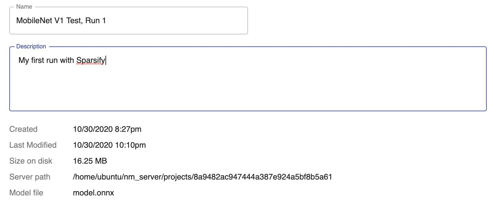
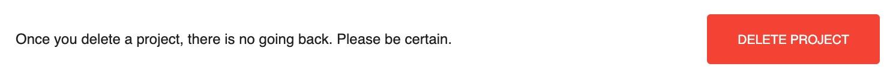

<!--
Copyright (c) 2021 - present / Neuralmagic, Inc. All Rights Reserved.

Licensed under the Apache License, Version 2.0 (the "License");
you may not use this file except in compliance with the License.
You may obtain a copy of the License at

   http://www.apache.org/licenses/LICENSE-2.0

Unless required by applicable law or agreed to in writing,
software distributed under the License is distributed on an "AS IS" BASIS,
WITHOUT WARRANTIES OR CONDITIONS OF ANY KIND, either express or implied.
See the License for the specific language governing permissions and
limitations under the License.
-->

# Settings

Settings for a saved project can be accessed from your project's left navigation bar. This dialog reflects any information that you entered for the project. Clicking into editable sections will display a "save button" and allow you to make changes. Settings includes three sections:

- Project Settings

    <kbd></kbd>

- Original Training Settings

    <kbd></kbd>

- Delete Project

    <kbd></kbd>

---
**Next step...**

Review general [Key Concepts, Features, and Terms](https://docs.neuralmagic.com/archive/sparsify/main/source/userguide/08-key-terms.html) mentioned throughout Sparsify.
