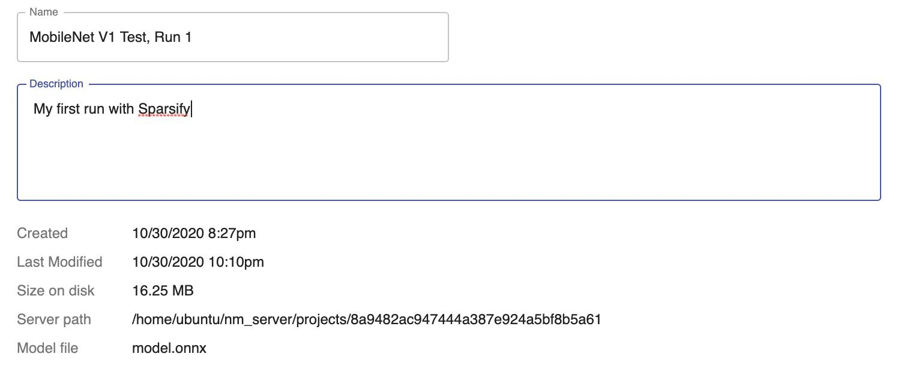
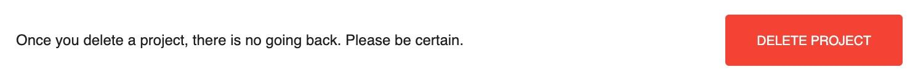

# Settings

Settings for a saved project can be accessed from your project's left navigation bar. This dialog reflects any information that you entered for the project. Clicking into editable sections will display a "save button" and allow you to make changes. Settings includes three sections:

- Project Settings

    <kbd></kbd>

- Original Training Settings

    <kbd></kbd>

- Delete Project

    <kbd></kbd>

---
**Next step...**

Review general [Key Concepts, Features, and Terms](08-key-terms.md) mentioned throughout Sparsify.
